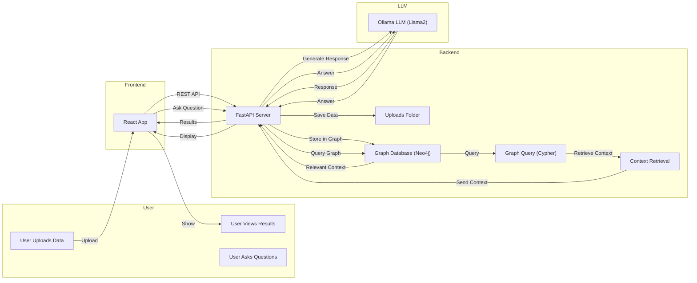

# Updated Architecture Flow (Mermaid)

Below is the updated Mermaid diagram representing the high-level flow of the Graph RAG System:

**Legend:**

- User interacts with the React frontend (upload, view results, ask questions)
- Frontend communicates with FastAPI backend
- Backend processes data, stores in a graph database, manages context retrieval and response generation
- Ollama LLM is used for generating responses
- Results are returned to the user via the frontend

---

For more details, see the rest of this `architecture.md` and the backend `README.md`.
